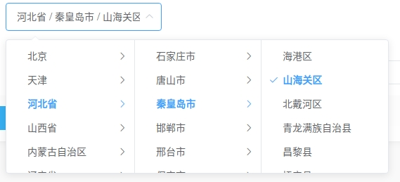

# Voyager Relation Selector

a plugin for relation selector

级联选择器插件，可用于省市区选择

## Install hook

```bash
php artisan hook:install tu6ge/voyager-relation-selector
```

## Enable hook

```bash
php artisan hook:enable tu6ge/voyager-relation-selector
```

## test

```
composer test
```

## Document

安装完本插件后，在BREAD编辑页的字段的输入类型中，可以看到多了三个备选项：

- Region Selector (地区选择器)
- Relation Selector (级联选择器)
- Relation Selector Parent (级联选择器对应的父级)

通常级联选择器与目标数据进行关联，有两种方式，一种是一级一级选择，把最后一级的结果跟数据进行绑定，另外一个种是把选择的每个级别，都关联到目标数据中，这一块省市区选择器用的比较多，接下来我们将以此为例说明这种选择器的用法。

### 只绑定一个数据
在这里，假设我们需要做一个博客系统，有两级分类，文章需要关联到第二级分类上
1. 首先我们创建`posts`表,里面包含`cate_id`字段，用于存储分类id，然后创建分类表`category`, 包含字段`id`,`name`,`pid`,`level`,分别存储分类id，分类名，上级分类id,分类的级别（顶级是1，第二级是2以此类推）。
2. 创建`Category`模型，用于管理分类表，在类中，我们需要引用`RelationModel`这个trait并且设置类的成员变量`parentKey`等于`pid`
```php
namespace DemoApp;
use VoyagerRelationSelector\Traits\RelationModel;

class Category extends Model
{
    use RelationModel;

    protected $parentKey = 'pid';
}
```
3. 打开`route/web.php`或者你喜欢的其他路由配置文件，添加如下记录用来定义一个ajax接口，

```php
use DemoApp\Category;

Route::get('category/{parent_id?}', function($parent_id=0){
    return Category::where('pid', $parent_id)->get()->map(function($res){
        return [
            'value' => $res->id,
            'label' => $res->name,
            'leaf' => $res->pid > 0,
        ];
    });
})->where([
    'parent_id' => '[0-9]+'
]);
```
返回值需要有如下固定格式：
- *value* 放置分类的id
- *label* 放置分类显示名
-  *leaf* 如果最终的分类，返回`true`否则返回`false`,本例中:第一级分类返回`false`,第二级分类返回`true`

4. 创建`post`表对应的BREAD，打开BREAD编辑页，找到`cate_id`字段，将其输入类型选择为` Relation Selector`,在可选细项中，添加如下记录
```json
{
    "model":"\\DemoApp\\Category",
    "resources_url":"/category/__pid__",
    "level":2
}
```
- *model* 放置第一步中创建的模型类
- *resources_url* 放置第二部中创建的ajax请求路由，其中`__pid__`是一个占位符
- *level* 用于设置级联选择器的级别

至此，级联选择器的设置就完成了，打开`post`的添加页面，即可看到一个类似于图片中样式的级联选择器



> 前端我们使用的国内知名的element-ui框架，查看[文档](https://element.eleme.io/#/zh-CN/component/cascader)


### 每级数据都做绑定的情况

在这里，假设我们需要做一个收获地址表
1. 创建地址表`address`, 包含字段`province`,`city`,`zone`,`address`,分别为省市区以及详细地址，创建地域表`region`,包含字段`id`,`name`,`parent_id`,`level`分别用于存储区域编号，区域名，对应的上级id，区域级别（省市区分别是1，2，3）
2. 创建`Region`模型，用于管理区域表，在类中，我们需要引用`RelationModel`这个trait并且设置类的成员变量`parentKey`等于`parent_id`

```php
namespace DemoApp;

use Illuminate\Database\Eloquent\Model;
use VoyagerRelationSelector\Traits\RelationModel;

class Region extends Model
{
    use RelationModel;

    protected $table = 'regions';

    protected $parentKey = 'parent_id';
}
```
3. 打开`route/web.php`或者你喜欢的其他路由配置文件，添加如下记录用来定义一个ajax接口:
```php
use DemoApp\Region;
Route::get('region/{parent_id?}', function($parent_id=0){
    return Region::where('parent_id', $parent_id)->get()->map(function($res){
        return [
            'value' => $res->id,
            'label' => $res->name,
            'leaf' => $res->level>=3,
        ];
    });
})->where([
    'parent_id' => '[0-9]+'
]);
```
返回值需要有如下固定格式：
- *value* 放置分类的id
- *label* 放置分类显示名
-  *leaf* 如果最终的分类，返回`true`否则返回`false`,本例中:第一级分类返回`false`,第二级分类返回`true`
4. 创建`address`表对应的BREAD，打开BREAD编辑页，找到`zone`字段，将其输入类型选择为` Relation Selector`,在可选细项中，添加如下记录
```json
{
    "relation":["province","city"],
    "resources_url":"/region/__pid__"
}
```
- *relation* 放置存放省，市信息的字段
- *resources_url* 放置第二部中创建的ajax请求路由，其中`__pid__`是一个占位符

5. 在BREAD编辑页中，把`province`,`city`字段的输入类型设置为`Relation Selector Parent`，主要作用是，在添加和编辑页，不使用默认的修改方式修改这两个字段

至此，级联选择器的设置就完成了，打开`address`的添加页面，即可看到一个图片中的级联选择器


### 省市区选择器
由于省市区选择器很常用，除了我们上面那种设置方式外，我们对该类型做了封装
1. 在安装本插件的时候，会创建一个区域表`region`包含了`id`,`name`,`parent_id`,`level`等多个字段
2. 在插件中，我们定义了一个路由`/vrs/region/__pid__`,我们可以使用这个进行层级查询
3. 创建`address`表对应的BREAD，打开BREAD编辑页，找到`zone`字段，将其输入类型选择为` Region Selector`,在可选细项中，添加如下记录
```json
{
    "relation":["province","city"],
}
```
- *relation*  放置存放省，市信息的字段
4. 在BREAD编辑页中，把`province`,`city`字段的输入类型设置为`Relation Selector Parent`，主要作用是，在添加和编辑页，不使用默认的修改方式修改这两个字段

至此，省市区选择器的设置就完成了，打开`address`的添加页面，即可看到一个图片中的级联选择器


## License

MIT

## Links

- [Voyager中文文档](http://doc.laravel-voyager.cn/)
- [国内插件源](http://satisfy.xiaoqiezi.top)
- [国内插件源使用方法](http://doc.laravel-voyager.cn/getting-started/installation.html#%E5%AE%89%E8%A3%85%E4%B8%AD%E6%96%87%E8%AF%AD%E8%A8%80%E5%8C%85)
